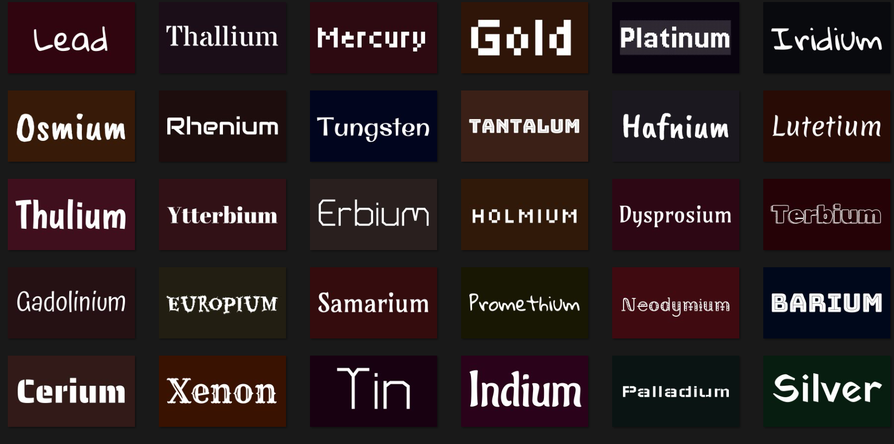

# text-wallpaper-generator-4k 
Rust script to generate 4k resolution wallpapers with text on a solid color background.
* Text into wallpaper
  * The text list is configurable in settings.toml
* Randomized solid color background
  * The color range is configurable in settings.toml
* Randomized font
  * Fonts are placed under the fonts folder
  * Free to add/remove
* Any size
  * Wallpaper size is configurable in settings.toml
* Generate multiple wallpapers with each text
  * The number is configurable in the settings.toml

# Supported resolution examples
Any size can be generated, even for smartphones.  
configure your resolution in settings.toml
| Resolution | Aspect Ratio | Name |
| :----- | :----- | :----- |
| 800x600 | 4:3 | SVGA |
| 1024x768 | 4:3 | XGA |
| 1280x720 | 16:9 | HD or 720p |
| 1280x800 | 16:10 | WXGA |
| 1360x768 | 16:9 | WXGA+ |
| 1366x768 | 16:9 | HD+ |
| 1440x900 | 16:10 | WXGA+ |
| 1536x864 | 16:9 | HD+ (variant) |
| 1600x900 | 16:9 | HD+ |
| 1920x1080 | 16:9 | Full HD (FHD) or 1080p |
| 1920x1200 | 16:10 | WUXGA |
| 1920x1280 | 3:2 | 3:2 Display |
| 2560x1440 | 16:9 | Quad HD (QHD) |
| 2560x1600 | 16:10 | WQXGA |
| 2880x1800 | 16:10 | Retina WQXGA+ |
| 3200x1800 | 16:9 | QHD+ |
| 3440x1440 | 21:9 | Ultrawide QHD |
| 3840x2160 | 16:9 | Ultra HD (UHD) or 4K |
| 5120x1440 | 32:9 | Super Ultrawide Dual QHD |
| 7680x4320 | 16:9 | 8K Ultra HD |

# Known limitation
- Can't handle all special Unicode character
  - Will not solve this
    - draw_text_mut() can't handle special character well
    - I tried but seems problem is in library. Tried another solution but can't solve the problem
    - My current stance is supporting rare usecase is not worth the time  

# How to use
Win users can use pre-built exe
1. download [text-wallpaper-generator-4k_0.1.0_WIN.zip](https://github.com/hiroa-inami/text-wallpaper-generator-4k/releases/download/0.1.0/text-wallpaper-generator-4k_0.1.0_WIN.zip
) and extract it
2. edit settings.toml with notepad (Optional)
3. add/remove fonts in fonts folder (Optional)
4. run exe

# How to build
Install [Rust](https://www.rust-lang.org/tools/install)  
clone repo and 
```
cargo run
```
will run script 

```
cargo build --release
```
will generate executable 
# How it works
[code](https://github.com/hiroa-inami/text-wallpaper-generator-4k/blob/main/src/main.rs) is a single file with 140 lines  
Read comments, which start with //

# about LICENSE
each font has its license  
everything else is MIT  

# Author and Github
hiroa ([github.com/hiroa-inami](https://github.com/hiroa-inami/))  
[github.com/hiroa-inami/text-wallpaper-generator-4k](https://github.com/hiroa-inami/text-wallpaper-generator-4k)  
[hiroa-inami.github.io/text-wallpaper-generator-4k](https://hiroa-inami.github.io/text-wallpaper-generator-4k/)

# Thank you.
- [Google Fonts](https://fonts.google.com/) for awesome platform
- Font creator on Google Fonts for beautiful fonts
- [Github](https://github.com/) for generous infrastructure
- [Rust Foundation](https://foundation.rust-lang.org/) for creating Rust

