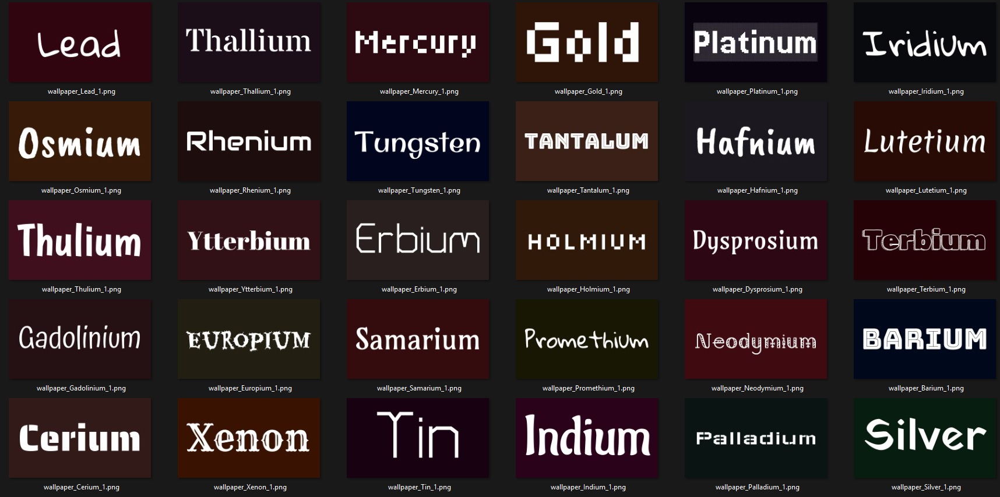

# text-wallpaper-generator-4k 
Rust script to generate 4k resolution wallpapers with text on a solid color background.
* Text into wallpaper
  * The text list is configurable in settings.toml
* Randomized solid color background
  * The color range is configurable in settings.toml
* Randomized font
  * Fonts are placed under the fonts folder
  * Free to add/remove
* Any size
  * Wallpaper size is configurable in settings.toml
* Generate multiple wallpapers with each text
  * The number is configurable in the settings.toml

# How to use
Only for Win user
1. Download the [release](https://github.com/hiroa-inami/wallpaper_generator/releases)   
2. edit settings.toml with notepad (Optional)
3. add your favorite font to fonts folder (Optional)
4. run exe

# How it works
[code](https://github.com/hiroa-inami/text-wallpaper-generator-4k/blob/main/src/main.rs) is a single file with 140 lines  
comments will help you

# How to build
Install [Rust](https://www.rust-lang.org/tools/install)  
clone repo and 
```
cargo run
```
